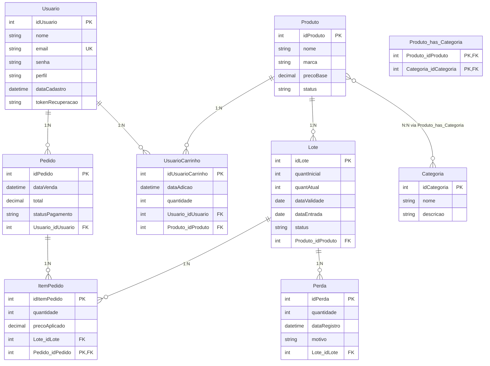

# Dupla Cor — Boutique de Esmaltes & Gestão de Estoque FEFO

O **Dupla Cor** é um sistema desenvolvido como parte da disciplina de Projeto Integrador, com o objetivo de desenvolver uma solução computacional voltada para o gerenciamento e organização das informações relacionadas ao negócio.

Aplicação Web completa desenvolvida em **HTML5, CSS3 (Vanilla) e JavaScript**, integrada a backend **Java (POO, MVC, DAO, JDBC)** e banco de dados **MySQL**.

A interface é inspirada na boutique de luxo [Dupla Cor Glam](https://dupla-cor-glam-ifbba.base44.app/), implementando controle inteligente de inventário baseado em lotes com rastreabilidade total, controle de validade e execução do algoritmo **FEFO (*First Expired, First Out*)**, além de carrinho persistente no banco de dados e painel administrativo completo.

---

## Tecnologias Utilizadas

- **Frontend:** HTML5 Semântico, CSS3 Moderno (Vanilla Design System com Glassmorphism), JavaScript (Vanilla SPA)
- **Backend:** Java 17+ (Compatível com Java 21) com `com.sun.net.httpserver.HttpServer` nativo para API REST e arquivos estáticos
- **Persistência:** JDBC Oficial (`com.mysql:mysql-connector-j:8.3.0`)
- **Banco de Dados:** MySQL 8.0 (9 tabelas derivadas rigorosamente do DER)
- **Containers:** Docker (Multi-stage build) & Docker Compose
- **Porta Padrão Web:** `http://localhost:8080`

---

## Telas Implementadas

### 1. Loja & Cliente (E-Commerce Boutique Glamour)
- **Início (`#home`):**
  - Hero Banner de luxo com apresentação da boutique e estatísticas.
  - Indicador do diferencial: *Algoritmo FEFO Ativo*.
  - Seletor rápido de coleções/categorias (Cremoso, Cintilante, Tratamento & Base, Glitter).
  - Vitrine de esmaltes disponíveis (filtra apenas produtos com lote válido e saldo positivo).
  - Seção de Recomendação Inteligente (Bases e Finalizadores).
  - Informações de Retirada no Local (*Local Pickup*).
- **Catálogo Completo (`#produtos`):**
  - Busca instantânea por nome ou marca.
  - Filtros por categoria e ordenação.
  - Cards com frascos de esmalte renderizados dinamicamente via SVG.
  - Modal de detalhes do produto com tabela de inspeção da fila FEFO (dias restantes até o vencimento).
- **Carrinho Persistente (`#carrinho`):**
  - Controle de quantidades (+ / -) e exclusão.
  - Cálculo de subtotal, frete grátis para retirada e valor total.
- **Checkout & Simulação FEFO (`#checkout`):**
  - Dados da cliente e seleção de pagamento (PIX, Cartão, Retirada).
  - **Visualizador transparente de lotes:** Exibe exatamente de quais lotes as unidades serão retiradas pelo algoritmo FEFO antes da confirmação.
- **Meus Pedidos (`#pedidos`):**
  - Histórico de pedidos com detalhamento dos lotes despachados.

### 2. Painel Administrativo (`#admin`)
- **Dashboard / Visão Geral:** Indicadores (Total de Produtos, Lotes Ativos, Lotes Vencidos, Faturamento) e alertas.
- **Gestão de Lotes & Motor FEFO:**
  - Tabela com todos os lotes, datas de entrada/validade, saldo e status.
  - Indicador visual dos lotes prioritários para expedição.
  - Cadastro de nova remessa de lote com vínculo ao produto.
  - Botão de varredura: *Bloquear Lotes Vencidos*.
- **Gestão de Produtos (Catálogo):** Cadastro e exclusão de esmaltes.
- **Gestão de Categorias:** Cadastro e listagem de acabamentos.
- **Auditoria de Perdas & Descarte:** Registro de descarte de lotes vencidos ou avariados com ajuste automático de saldo.
- **Gestão de Pedidos:** Acompanhamento de todas as vendas da loja.

---

## Arquitetura do Software

```
┌─────────────────────────────────────────────────────────────┐
│                    FRONTEND WEB (SPA)                       │
│        web/index.html + web/css/style.css                   │
│        web/js/app.js  + web/js/fefo.js + web/js/api.js      │
└──────────────────────────────┬──────────────────────────────┘
                               │ HTTP / REST JSON (porta 8080)
                               ▼
┌─────────────────────────────────────────────────────────────┐
│                 BACKEND JAVA (HTTP & REST API)              │
│                     server.WebServer.java                   │
└──────────────────────────────┬──────────────────────────────┘
                               │ Chamadas de Negócio
                               ▼
┌─────────────────────────────────────────────────────────────┐
│                   CONTROLLER (Regras FEFO)                  │
│       ProdutoController, LoteController, PedidoController   │
└──────────────┬──────────────────────────────┬───────────────┘
               │ Usa                          │ Manipula
               ▼                              ▼
┌──────────────────────────────┐ ┌────────────────────────────┐
│         DAO (JDBC)           │ │       MODEL (POO)          │
│    PreparedStatement, SQL,   │ │ 9 classes mapeadas do DER  │
│  Conexão via Conexao.java    │ │ BigDecimal, LocalDate      │
└──────────────┬───────────────┘ └────────────────────────────┘
               │ Queries SQL
               ▼
┌─────────────────────────────────────────────────────────────┐
│                      BANCO DE DADOS                         │
│                    MySQL (database/schema.sql)              │
└─────────────────────────────────────────────────────────────┘
```

---

## Estrutura do Projeto

```
DuplaCor/
├── Dockerfile                   # Build multi-stage Maven + JRE leve
├── docker-compose.yml           # MySQL 8.0 + Aplicação Java Web (8080:8080)
├── .env                         # Variáveis de ambiente locais
├── .env.example                 # Modelo de variáveis de ambiente
├── .gitignore                   # Arquivos ignorados pelo Git
├── .dockerignore                # Arquivos ignorados no contexto Docker
├── pom.xml                      # Configuração do Maven
├── README.md                    # Documentação do projeto
├── database/
│   └── schema.sql               # Script DDL/DML de criação do banco e seeds
├── web/                         # INTERFACE WEB (HTML, CSS, JS)
│   ├── index.html               # Aplicação SPA completa
│   ├── css/
│   │   └── style.css            # Design System Glamour
│   └── js/
│       ├── app.js               # Controlador SPA, rotas e eventos
│       ├── api.js               # Cliente REST com fallback local
│       └── fefo.js              # Motor do algoritmo FEFO e gerador SVG
└── src/
    ├── model/                   # 9 Entidades POO mapeadas do DER
    ├── dao/                     # 9 DAOs JDBC + Conexao.java
    ├── controller/              # 7 Controllers de negócio
    ├── server/
    │   └── WebServer.java       # Servidor HTTP nativo REST na porta 8080
    └── view/
        └── MenuPrincipal.java   # Interface de console alternativa
```

---

## Banco de Dados e DER (9 Tabelas)



---

## Como Executar

### Opção 1: Executando com Docker (Recomendado)

O Docker Compose inicializa o banco de dados MySQL 8.0, executa o `database/schema.sql` e inicia o servidor Web Java na porta `8080`.

```bash
# 1. Iniciar os containers
docker compose up --build -d

# 2. Abrir a aplicação no navegador
# Acesse: http://localhost:8080

# 3. Visualizar logs
docker compose logs -f app

# 4. Parar a aplicação
docker compose down
```

---

### Opção 2: Executando no Eclipse IDE

1. Abra o Eclipse e importe o projeto `DuplaCor`.
2. Execute o arquivo [`src/server/WebServer.java`](file:///c:/Users/Naiara/eclipse-workspace/DuplaCor/src/server/WebServer.java) como **Java Application**.
3. Abra seu navegador em: **`http://localhost:8080`**.

---

### Opção 3: Visualização Direta dos Arquivos Web

Você também pode abrir diretamente o arquivo [`web/index.html`](file:///c:/Users/Naiara/eclipse-workspace/DuplaCor/web/index.html) em qualquer navegador web moderno (Google Chrome, Edge, Firefox). O cliente JavaScript possui sincronização inteligente e fallback local com todos os dados de demonstração já carregados!
