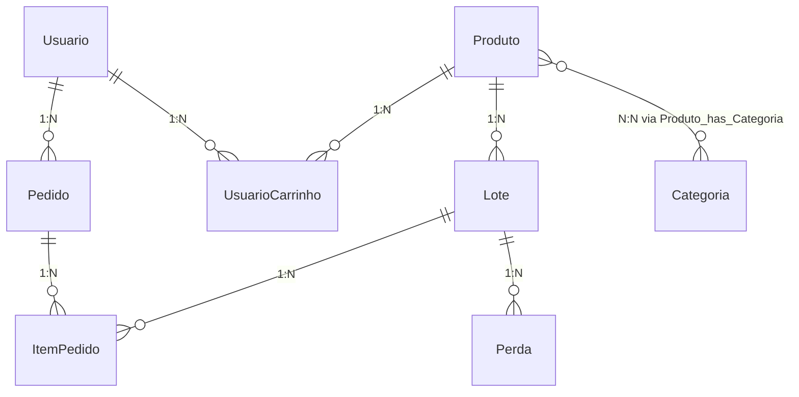

# Diagrama Entidade-Relacionamento — Dupla Cor

## Estrutura do Banco de Dados (9 Tabelas)

### 1. `Usuario`
- `idUsuario` INT (PK, Auto Increment)
- `nome` VARCHAR(45) NOT NULL
- `email` VARCHAR(45) NOT NULL UNIQUE
- `senha` VARCHAR(45) NOT NULL
- `perfil` VARCHAR(45)
- `dataCadastro` DATETIME
- `tokenRecuperacao` VARCHAR(45)

### 2. `Categoria`
- `idCategoria` INT (PK, Auto Increment)
- `nome` VARCHAR(45) NOT NULL
- `descricao` VARCHAR(255)

### 3. `Produto`
- `idProduto` INT (PK, Auto Increment)
- `nome` VARCHAR(45) NOT NULL
- `marca` VARCHAR(45)
- `precoBase` DECIMAL(10,2) NOT NULL
- `status` VARCHAR(45) NOT NULL

### 4. `Produto_has_Categoria` (Associativa N:N)
- `Produto_idProduto` INT (PK, FK -> Produto.idProduto)
- `Categoria_idCategoria` INT (PK, FK -> Categoria.idCategoria)

### 5. `Lote`
- `idLote` INT (PK, Auto Increment)
- `quantInicial` INT NOT NULL
- `quantAtual` INT
- `dataValidade` DATE NOT NULL
- `dataEntrada` DATE NOT NULL
- `status` VARCHAR(45) NOT NULL
- `Produto_idProduto` INT (FK -> Produto.idProduto)

### 6. `Perda`
- `idPerda` INT (PK, Auto Increment)
- `quantidade` INT
- `dataRegistro` DATETIME
- `motivo` VARCHAR(45)
- `Lote_idLote` INT (FK -> Lote.idLote)

### 7. `Pedido`
- `idPedido` INT (PK, Auto Increment)
- `dataVenda` DATETIME
- `total` DECIMAL(10,2) NOT NULL
- `statusPagamento` VARCHAR(45) NOT NULL
- `Usuario_idUsuario` INT (FK -> Usuario.idUsuario)

### 8. `ItemPedido`
- `idItemPedido` INT (PK, Auto Increment)
- `quantidade` INT NOT NULL
- `precoAplicado` DECIMAL(10,2) NOT NULL
- `Lote_idLote` INT (FK -> Lote.idLote)
- `Pedido_idPedido` INT (PK, FK -> Pedido.idPedido)

### 9. `UsuarioCarrinho`
- `idUsuarioCarrinho` INT (PK, Auto Increment)
- `dataAdicao` DATETIME
- `quantidade` INT NOT NULL
- `Usuario_idUsuario` INT (FK -> Usuario.idUsuario)
- `Produto_idProduto` INT (FK -> Produto.idProduto)

## Diagrama Mermaid

